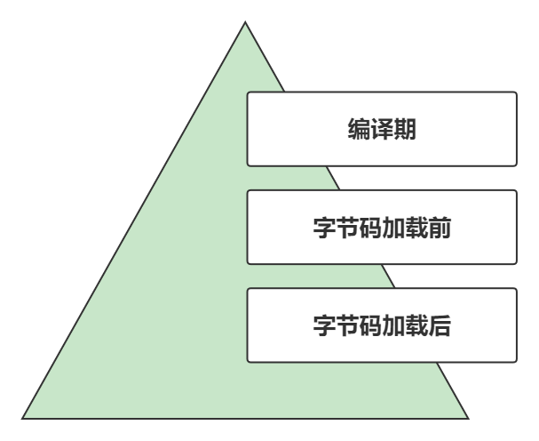
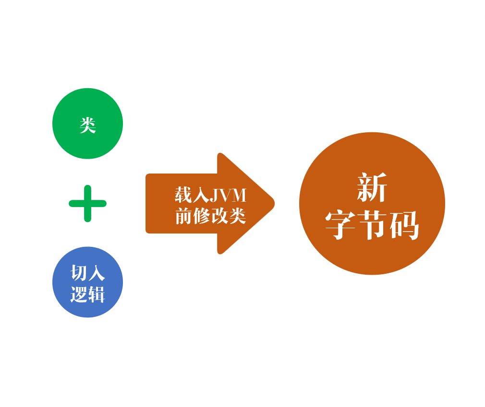

# 一文读懂Spring

> 作者: 潘深练
>
> 更新: 2022-03-14


## 关于概念

对于程序员来说，我们通常知道很多概念，例如组件、模块、系统、框架、架构等。

- **框架**，本质上是一些实用经验集合。即是前辈们在实际开发过程中积攒下来的实战经验，累积成一套实用工具，避免你在开发过程中重复去造轮子，特别是帮你把日常中能遇到的场景或问题都给屏蔽掉，框架的意义在于屏蔽掉开发的基础复杂度、屏蔽掉此类共性的东西，让框架使用者只关注于差异面，即业务层面的实现。简而言之，框架只干一件事，那就是 **简化开发**。然后在此基础上，可能会再考虑一些安全性、效率、性能、弹性、管理、拓展、解耦等等。

- **架构**，是我们关注的系统层面的一个顶层结构。

## Spring核心

Spring 作为一个框架，目的也是：**简化开发** ，只不过在简化开发的过程中 Spring 做了一个特别的设计，那就是 `Bean管理`，这也是 Spring 的设计核心，而 Bean 生命周期管理的设计巧妙的 `解耦了 Bean 之间的关系`。

因此 Spring 核心特性就是 **解耦** 和 **简化**。


Spring 框架图示展示得很清晰，基本描绘出 Spring 框架的核心：

- **内核**
- **外延**

简单说，就是 Spring 设计了一个核心容器 `Core Container`，这里头主要就是管理 Bean 生命周期，然后为了服务这些业务 Bean ，引入了 `Core` , `Context` , `SpEL` 等工具到核心容器中。然后在核心容器基础上，又为了把更多的能力集成进来，例如为了拓展 **数据访问** 能力加入了 `JDBC` 、`ORM` 、`OXM` 、`JMS` 、`Transactions`等，为了拓展 **Web** 能力加入了 `WebSocket` 、`Servlet`、`Web`、`Portlet`等，其中为了把 `RequestMapping` 或 `Servlet` 等这些使用集成到业务 Bean 上，引入了 `AOP` ，包括还有引入（最终是提供） `Aspects`、`Instrumentation`、`Messageing`等增强方式。

所以仔细一看，Spring 就是把像数据库访问、Web支持、缓存、消息发送等等这些能力集成到业务 Bean 上，并提供一些测试支持。总结来说理解 Spring 就两点：

1. **Bean管理：** 解耦Bean关系。理解为内核，从 Bean 的定义、创建、管理等，这是业务Bean。

2. **功能增强：** 解耦功能、声明式简化。理解为外延，在业务Bean基础上，需要访库等能力，那就是功能增强。


基本体现的就是两个核心特性，一个 **解耦**、一个 **简化**。


Bean管理本身就是在做解耦，解除耦合，这个解耦指 Bean 和 Bean 之间的关联关系，Bean 之间通过接口协议互相串联起来的，至于每个接口有多少个实现类，那都不会有任何影响，Bean 之间只保留单点通道，通过接口相互隔离，关系都交给 Spring 管理，这样就避免了实现类和实现类之间出现一些耦合，就算方法增减了、引用变更了也不至于互相污染。

功能增强本身就是在做简化，例如声明式简化，像声明式编程，使用者只需要告诉框架他要什么，不用管框架是如何实现的。另外简化方面还有 **约定优于配置** （当然这个确切的说是 `SpringBoot` 里的设计），约定优于配置其实就是约定好了无需去做复杂的配置，例如你引入一个什么组件或能力就像 `redis` 或 `kafka` ，你不需要提前配置，因为 `springboot` 已经为你默认配置。

> 最后再总结 Spring 框架特性，就是 **解耦** 和 **简化** ，没有其它了。

对于 SpringBoot，简单理解就是在 Spring 框架基础上添加了一个 `SPI 可拓展机制` 和 `版本管理`，让易用性更高，简化升级。

对于 SpringCloud，简单理解就是，由于 SpringBoot 的 **依赖** 可以被很好的管理，**拓展** 可以被可插拔的拓展，因此在 SpringBoot 基础上集成了很多跟微服务架构相关的能力，例如集成了很多组件。

所以我们说回 Spring 的核心设计。

## IoC 

我们说了 Spring 的其一特性是 **解耦**，那到底是使用什么来解耦？ 


控制反转（`Inversion of Control`，缩写为`IoC`），是面向对象编程中的一种设计原则，可以用来减低计算机代码之间的耦合度。其中最常见的方式叫做依赖注入（`Dependency Injection`，简称`DI`），还有一种方式叫“依赖查找”（`Dependency Lookup`，`EJB`和`Apache Avalon` 都使用这种方式）。通过控制反转，对象在被创建的时候，由一个调控系统内所有对象的外界实体将其所依赖的对象的引用传递给它。也可以说，依赖被注入到对象中。

简单来说，就是原本 Bean 与 Bean 之间的这种互相调用，变成了由 `IoC` 容器去统一调配。如果没使用 `IoC` 容器统一管理业务 Bean，你的应用在部署、修改、迭代的时候，业务 Bean 是会侵入代码实现并互相调用的。

> `IoC` 容器是面向 `迭代` 起作用，如果你的应用就 **不存在迭代** 的情况，即系统是万年不变的，那没必要引入 `IoC`，因为你每引入一项技术，都势必会增加复杂度，所以额外引入 `IoC` 也一样会增加你整体应用的复杂度，所以假如 **不存在迭代**，大可直接写死A类引用B类，B类又写死引用C类，无需引入 `IoC`。一定要理解每一项技术背后是为了解决什么问题，同时在做架构设计的时候记住两个原则：**合适** 、**简单**。当然，实际上我们大部分应用是 **持续迭代** 的，在类实现上、互相引用上、甚至接口协议上都有可能变化，所以一般引入 `IoC` 是合适的（如果是接口协议变化，即参数或返回值发生变化，那还是需要改动类间的代码的）。

具体的，`IoC` 相当于是把 Bean 实例的创建过程交给 Spring 管理，无论是通过 `XML`、`JavaConfig`，还是 `注解` 方式，最终都是把实例化的工作交给 Spring 负责，之后 Bean 之间通过接口相互调用，而实例化过程中就涉及到 `注入`，无论采用什么方式来实例化 Bean，`注入` 的类别就两种：

- **Setter注入** ： 通过 `setter` 来设置，发生在对象 **实例化之后** 设置。
- **构造器注入** ： 通过构造器注入，发生在对象 **实例化之前** 就得把参数/实例准备好。

**setter注入：**

1. 与传统的JavaBean的写法更相似，程序开发人员更容易理解、接受。通过`setter`方法设定依赖关系显得更加直观、自然。
2. 对于复杂的依赖关系，如果采用构造注入，会导致构造器过于臃肿，难以阅读。Spring在创建Bean实例时，需要同时实例化其依赖的全部实例，因而导致性能下降。而使用设值注入，则能避免这些问题。
3. 尤其在某些成员变量可选的情况下，多参数的构造器更加笨重。

**构造器注入：**

1. 构造器注入可以在构造器中决定依赖关系的注入顺序，优先依赖的优先注入。
2. 对于依赖关系无需变化的Bean，构造注入更有用处。因为没有`setter`方法，所有的依赖关系全部在构造器内设定，无须担心后续的代码对依赖关系产生破坏。
3. 依赖关系只能在构造器中设定，则只有组件的创建者才能改变组件的依赖关系，对组件的调用者而言，组件内部的依赖关系完全透明，更符合高内聚的原则。

其中，注入方式使用了 `反射`。

## 反射 


`java.lang.reflect` 包提供了许多反射类，用于获取或设置实例对象。简单来说，反射能够：

1. **在运行时** 判断任意一个对象所属的类；
2. 在运行时构造任意一个类的对象；
3. 在运行时判断任意一个类所具有的成员变量和方法；
4. 在运行时调用任意一个对象的方法；
5. **生成动态代理**。

`IoC`和`反射`，只是把 Bean 的实例创建处理完，而后续还有 **功能增强**，功能增强靠的就是 `AOP`。

## AOP

AOP（`Aspect Oriented Programming`的缩写）就是面向切面编程，通过 **预编译** 方式和运行期间 **动态代理** 实现程序功能的统一维护的一种技术。一般有两类实现方式：

- **命令式编程** ，new一个代理类，在方法前后做一些增强逻辑，此种实现相对耦合，但是灵活性最高.
- **声明式编程+注解** ， spring大部分是此种实现，很大程度上为了简化、解耦，实际使用居多。

```java
// 示例01-声明式编程+注解
// 第一次延迟1秒后执行，之后按fixedRate的规则每5秒再执行一次
@Scheduled(InitialDelay=1000, fixedRate=5000) 

// 示例02-声明式编程+注解
@Cacheable(name="book",key="#isbn",conditional="xxx",allEntries=true,beforeInvocation=true)
public Book findBook(ISBN isbn,boolean checkWarehouse,boolean includeUsed) 

// 示例03-声明式编程+注解
// 针对某个方法不开启事务
@Transactional(propagation=Propagation.NOT_SUPPORTED) 
```

> AOP 功能增强

- 性能监控，在方法调用前后记录调用时间，方法执行太长或超时报警。
- 缓存代理，缓存某方法的返回值，下次执行该方法时，直接从缓存里获取。
- 软件破解，使用AOP修改软件的验证类的判断逻辑。
- 记录日志，在方法执行前后记录系统操作日志。
- 工作流系统，工作流系统需要将业务代码和流程引擎代码混合在一起执行，那么我们可以使用AOP将其分离，并动态挂接业务。
- 权限验证，方法执行前验证是否有权限执行当前方法，没有则抛出没有权限执行异常，有业务代码捕捉。
- 等等

**前面我们说 `IoC` 的实现靠反射，然后解耦，那 `AOP` 靠啥实现？**



`AOP`，简单来说就是给对象增加一些功能，那我们得看 Java 给我们预留了哪些口或者在哪些阶段，允许我们去织入某些增强功能？

- **编译期** 
    - 原理：在 javac 编译之前注入源代码，源代码被编译之后的字节码自然会包含这部分注入的逻辑。
	- 代表作如：lombok, mapstruct（编译期通过`pluggable annotation processing API` 修改的）。

- **字节码加载前** 
    - 原理：字节码要经过 classloader（[类加载器](http://jvm.panshenlian.com/#/zh-cn/06-class-loader)）加载，那我们可以通过 [自定义类加载器](http://jvm.panshenlian.com/#/zh-cn/06-define-class-loader) 的方式，在字节码被自定义类加载器 `加载前` 给它修改掉。
	- 代表作如：javasist, java.lang.instrument ,ASM（操纵字节码）。
	- 许多agent如 `Skywaking`, `Arthas` 都是这么搞，注意区分`静态agent` 与`动态agent`。
	- `JVMTI`是`JVM`提供操作`native`方法的工具，`Instrument`就是提供给你操纵`JVMTI`的java接口，详情见 [java.lang.instrument.Instrumentation](https://docs.oracle.com/javase/8/docs/api/java/lang/instrument/package-summary.html)

- **字节码加载后**
    - 原理：字节码被类加载器加载后，动态构建字节码文件生成目标类的 **子类**，将切面逻辑加入到子类中。
	- 代表作如：jdk proxy, cglib。


> 按照类别分类，基本可以理解为：


|类别|机制|原理|优点|缺点|
|----|----|----|----|----|
|静态AOP|静态织入|在编译期，切面以源代码的形式添加到目标方法前后|对系统无性能影响|灵活度不够|
|动态AOP|[动态代理](http://spring.panshenlian.com/#/zh-cn/02-java-dynamic-proxy)|在运行期，目标类加载后，为接口动态生成代理类，将切面织入到代理类中|相对于静态AOP更加灵活|切入的关注点需要实现接口，对系统有一点性能影响|
|动态字节码生成|在运行期，目标类加载后，动态构建字节码文件生成目标类的 **子类**，将切面逻辑加入到子类中|-|没有接口也可以织入|扩展类的实例方法为final时，则无法进行织入。性能基本是最差的，因为需要生成子类嵌套一层，spring就是这么搞的，所以性能比较差|
|自定义类加载器|在字节码被自定义类加载器 `加载前`，将切面逻辑加到目标字节码里|例如阿里的Pandora|可以对绝大部分类进行织入|代码中如果使用了其他类加载器，则这些类将不会被织入|
|字节码转换|在运行期，所有类加载器加载字节码前，进行拦截|可以对所有类进行织入|-|-|


**当然**，理论上是越早织入，性能越好，像`lombok`,`mapstruct`这类静态AOP，基本在编译期之前都修改完，所以性能很好，但是灵活性方面当然会比较差，获取不到运行时的一些信息情况，所以需要权衡比较。

### 简单说明5种类别：

> 1、静态AOP

发生在**编译期**，通过 `Pluggable Annotation Processing API` 修改源码。 


在 javac 进行编译的时候，会根据源代码生成抽象语法树（AST），而 java 通过开放 `Pluggable Annotation Processing API` 允许你参与修改源代码，最终生成字节码。典型的代表就是 `lombok`。


> 2、动态AOP

[动态代理](http://spring.panshenlian.com/#/zh-cn/02-java-dynamic-proxy)，发生在**字节码加载后**，类、方法已经都被加载到方法区中了。


典型的代表就是 `JDK Proxy`。


其中代理实现 `InvocationHandler` 接口，最终实现逻辑在 `invoke` 方法中。生成代理类之后，只要目标对象的方法被调用了，都会优先进入代理类 `invoke` 方法，进行增强验证等行为。


当然动态代理相对也是性能差，毕竟也多走了一层代理，每多走一层就肯定是越难以优化。

> 3、动态字节码生成

发生在**字节码加载后**，类、方法同样已经都被加载到方法区中了。


典型的代表就是 `Cglib`（底层也是基于ASM操作字节码）， `Cglib` 底层是基于 `ASM` 进行字节码文件操作的。


`Spring` 默认采取的`动态代理`机制实现`AOP`，当动态代理不可用时（代理类无接口）会使用`CGlib`机制，缺点是：

1. 只能对方法进行切入，不能对接口、字段、static静态代码块、private私有方法进行切入。

2. 同类中的互相调用方法将不会使用代理类。因为要使用代理类必须从Spring容器中获取Bean。同类中的互相调用方法是通过 `this` 关键字来调用，`spring` 基本无法去修改 `jvm` 里面的逻辑。

3. 使用 `CGlib` 无法对 final 类进行代理，因为无法生成子类了。

> 4、自定义类加载器
 
在类加载到JVM之前直接修改某些类的 **方法**，并将 **切入逻辑** 织入到这个方法里，然后将修改后的字节码文件交给虚拟机运行。



典型的代表就是 `javasist`，它可以获得指定方法名的方法、执行前后插入代码逻辑。


> 5、字节码转换

也是发生在 **字节码加载前**，`Java 1.5` 开始提供的 `Instrumentation API` 。`Instrumentation API` 就像是 `JVM` 预先放置的后门，它可以拦截在JVM上运行的程序，修改字节码。

这种方式是 Java API 天然提供的，在 `java.lang.instrumentation` ，就算 `javasist` 也是基于此实现。

一个代理实现 `ClassFileTransformer` 接口用于改变运行时的字节码（`class File`），这个改变发生在 `jvm` 加载这个类之前，对所有的类加载器有效。`class File` 这个术语定义于虚拟机规范`3.1`，指的是字节码的 `byte` 数组，而不是文件系统中的 `class` 文件。接口中只有一个方法：

```java
byte[]
    transform(  ClassLoader         loader,
                String              className,
                Class<?>            classBeingRedefined,
                ProtectionDomain    protectionDomain,
                byte[]              classfileBuffer)
        throws IllegalClassFormatException;

// 把 classBeingRedefined 重定义之后再交还回去
```

`ClassFileTransformer` 需要添加到 `Instrumentation` 实例中才能生效。

## 安全点使用

当对 JVM 中的字节码进行修改的时候，虚拟机也会通知所有线程通过安全点的方式停下来，因为修改会影响到类结构。

## 启动流程


Bean生命周期管理，基本从无到有（IoC），从有到增强（AOP）。

任何Bean在Spring容器中只有三种形态，**定义**、**实例**、**增强**。 

从Bean定义信息观察，通过 `xml` 定义 **bean关系**，`properties`、`yaml`、`json`定义 **属性**，bean关系和属性就构成Bean的定义，其中`BeanDefinitionReader`负责扫描定义信息生成Bean定义对象 `BeanDefinition`。在此基础上，允许对 `BeanDefinition` 定义进行增强（Mybatis与Spring存在很多使用场景）。  

Bean定义完成之后，开始通过反射实例化对象、填充属性等，同时又再次预留了很多增强的口，最终生成一个完整的对象。

### 实例化流程与三级缓存 

从定义到扩展，然后反射实例化，到增强，每种状态都会存在引用。

所以Spring设计 **三级缓存**，说白了是对应存储Bean生命周期的三种形态:

- 定义
- 实例
- 增强

 

## 总结

> Spring 就是 **反射** + **字节码增强**

- 反射，为了IoC和 **解耦**

- 字节码增强，为了 **简化** 和声明式编程

（本篇完）

?> ❤️ 您也可以参与梳理，快来提交 [issue](https://github.com/senlypan/spring-docs/issues) 或投稿参与吧~