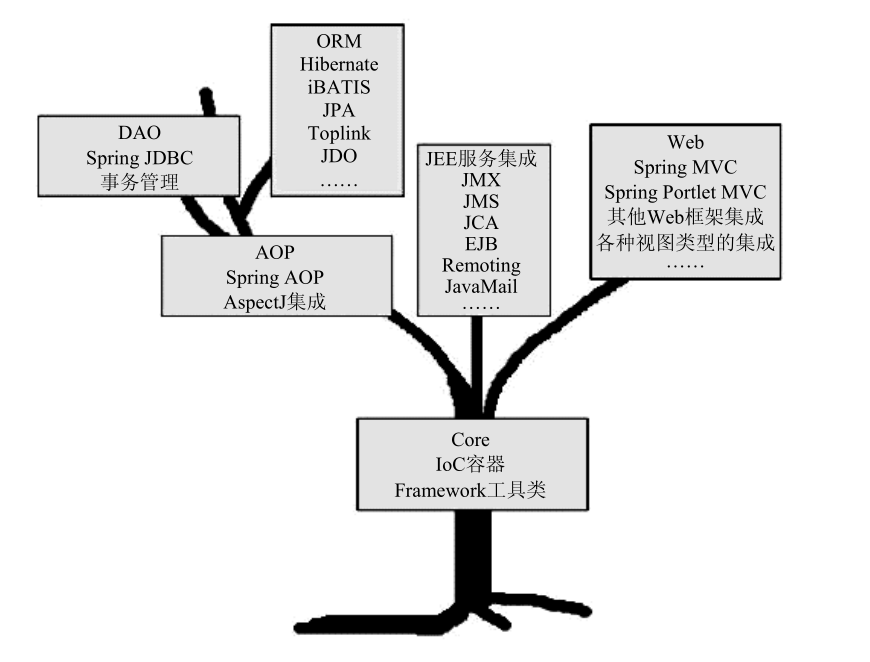
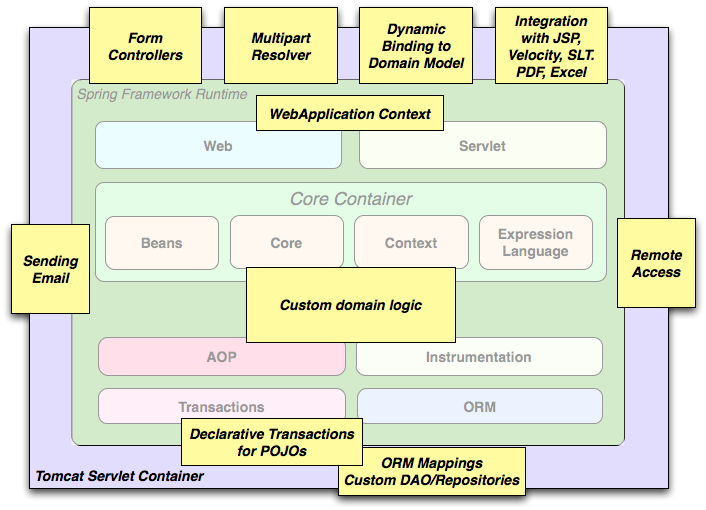
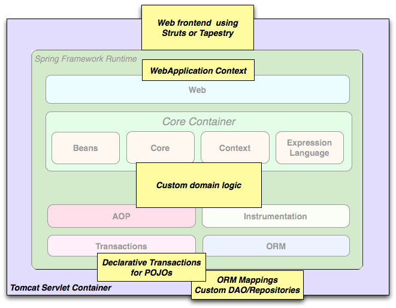
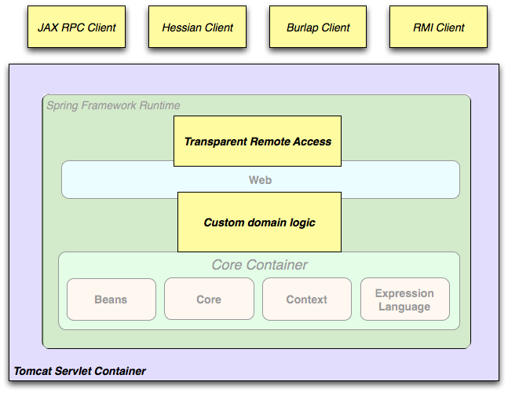
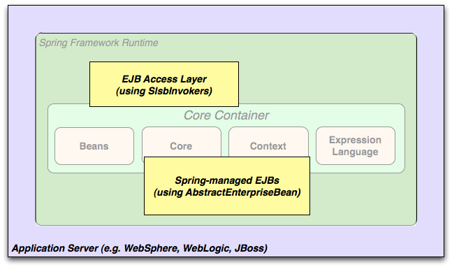

# 走近Spring

> 作者: 潘深练
>
> 更新: 2022-03-10

## Spring历史

| 年份 | 事件 |
|------|-----|
| 1997| [IBM](https://www.ibm.com/) 提出了 [EJB](https://en.wikipedia.org/wiki/Jakarta_Enterprise_Beans) 的思想 |
| 1998| [SUN](https://en.wikipedia.org/wiki/Sun_Microsystems) 制定开发标准规范 EJB1.0|
| 1999| EJB 1.1 标准制定 |
| 2001| EJB 2.0 标准制定|
| 2002| Rod Johnson (`Spring之父`) 发布《[Expert One-on-One J2EE Design and Development](https://book.douban.com/subject/1483761/)》一书，阐述了J2EE使⽤EJB开发设计的优点及解决⽅案|
| 2003| EJB 2.1 标准制定|
| 2004| Rod Johnson 发布《[Expert One-to-One J2EE Development without EJB](https://book.douban.com/subject/1426848/)》一书，阐述了J2EE开发不使⽤EJB的解决⽅式|
| 2004| Spring 1.0 发布|
| 2006| EJB 3.0 标准制定|
| 2006| Spring 2.0 发布 |
| 2009| Spring 3.0 发布 |
| 2013| Spring 4.0 发布|
| 2017| Spring 5.0 发布|
| 2020| EJB 4.0发布|
| 2022| 最新的 Spring 版本是 5.3.16|

## Spring生态

很多公司都在使用 `Spring` 生态的技术， [Srping 官网](https://spring.io/) 目前拥有 22 个开源项目。

- Spring Boot
- Spring Framework
- Spring Data
- Spring Cloud
- Spring Cloud Data Flow
- Spring Security
- Spring for GraphQL
- Spring Session
- Spring Integration
- Spring HATEOAS
- Spring REST Docs
- Spring Batch
- Spring AMQP
- Spring CredHub
- Spring Flo
- Spring for Apache Kafka
- Spring LDAP
- Spring Shell
- Spring Statemachine
- Spring Vault
- Spring Web Flow
- Spring Web Services

## Spring简介

`J2EE`作为一种企业级应用开发平台，其优异表现是我们有目共睹的。但纵使是最为强大的军队，如果没有一个好的指挥官，不知道如何发挥这支军队的强大战斗力，那这支军队也不可能取得太多辉煌的战果。在`J2EE`平台的一些早期实践中，就出现了对`J2EE`平台所提供的各项服务的滥用，将基于`J2EE` 平台的企业级开发带入了窘境。

`Spring`是于2003年兴起的一个轻量级的`Java`开发框架，由Rod Johnson在其著作 《[Expert One-on-One J2EE Design and Development](https://book.douban.com/subject/1483761/)》 中阐述的部分理念和原型衍生而来。它的最初目的主要是为了 **简化Java EE的企业级应用开发**，相对于过去EJB1时代 **重量级** 的企业应用开发而言，Spring框架的出现为曾经阴霾的天空带来了灿烂的阳光。

Spring 是一套分层的 `full-stack`（全栈） 轻量级开源框架，以 `IoC` 和 `AOP` 为内核，提供了展现层 `Spring MVC` 和业务层事务管理等众多的企业级应⽤技术，还能整合开源世界众多著名的第三⽅框架和类库，已经成为使⽤最多的 `Java EE` 企业应⽤开源框架。在 `Java` 社区中特别流行，基本上完全代替了企业级`JavaBeans`（EJB）模型。

## 核心结构

Spring是⼀个分层⾮常清晰并且依赖关系、职责定位⾮常明确的轻量级框架，主要包括⼏个⼤模块：数据处理模块、Web模块、AOP（Aspect Oriented Programming）/Aspects模块、Core Container模块和 Test 模块，如下图所示，Spring依靠这些基本模块，实现了⼀个令⼈愉悦的融合了现有解决⽅案的零侵⼊的轻量级框架。


- **核⼼容器**（`Core Container`） 容器是`Spring`框架最核⼼的部分，它管理着`Spring`应⽤中`bean`的创建、配置和管理。在该模块中，包括了`Spring bean`⼯⼚，它为`Spring`提供了`DI`的功能。基于`bean`⼯⼚，我们还会发现有多种`Spring`应⽤上下⽂的实现。所有的`Spring`模块都构建于核⼼容器之上。

- **⾯向切⾯**（`AOP`）/`Aspects` `Spring`对⾯向切⾯编程提供了丰富的⽀持。这个模块是`Spring`应⽤系统中开发切⾯的基础，与`DI`⼀样，`AOP`可以帮助应⽤对象解耦。

- **数据访问**（`Data Access`/`Integration`）`Spring`的`JDBC`和`DAO`模块封装了⼤量样板代码，这样可以使得数据库代码变得简洁，也可以更专注于我们的业务，还可以避免数据库资源释放失败⽽引起的问题。 另外，`Spring AOP`为数据访问提供了事务管理服务，同时`Spring`还对`ORM`进⾏了集成，如`Hibernate`、`MyBatis`等。该模块由`JDBC`、`Transactions`、`ORM`、`OXM` 和 `JMS` 等模块组成。

- **网页支持** 该模块提供了`SpringMVC`框架给`Web`应⽤，还提供了多种构建和其它应⽤交互的远程调⽤⽅案。 `SpringMVC`框架在`Web`层提升了应⽤的松耦合⽔平。

- **测试支持** 为了使得开发者能够很⽅便的进⾏测试，`Spring`提供了测试模块以致⼒于`Spring`应⽤的测试。 通过该模块，`Spring`为使⽤`Servlet`、`JNDI`等编写单元测试提供了⼀系列的`mock`对象实现。`Test模块`支持使用 `JUnit` 或 `TestNG` 测试 `Spring` 组件。它提供一致的 `Spring` `ApplicationContexts` 加载和这些上下文的缓存。它还提供了可用于单独测试代码的模拟对象。

## 核心思想



### Core核心

> 整个Spring框架构建在Core核心模块之上，它是整个框架的基础。

组成整个Spring框架的各种服务实现被划分到了多个相互独立却又相互依赖的模块当中。这些模块组成了Spring生命之树的枝和干，说白了也就是它们组成了Spring框架的核心骨架。抓住了这副骨架，也就抓住了Spring框架的学习主线。

### 依赖注入（Dependency Injection Containers）

IoC是轻量级容器（`Lightweight Container`)兴起而逐渐被很多人提起的一个名词，它的全称为 `Inversion of Control`，中文通常翻译为“控制反转”，它还有一个别名叫做依赖注入（`Dependency Injection`）。

- 构造方法注入
- setter方法注入
- 接口注入

```text
《Expert Spring MVC and Web Flow》 和 《Expert One-on-One J2EE without EJB》 
等书中都将依赖注入看作是IoC的一种方式。
```

### 面向切面编程（Aspect-Oriented Programming）

> 关于AOP

OOP：`Object Oriented Programming`，OOP作为面向对象编程的模式，获得了巨大的成功，OOP的主要功能是数据封装、继承和多态。

而AOP是一种新的编程方式，它和OOP不同，OOP把系统看作多个对象的交互，AOP把系统分解为不同的关注点，或者称之为切面（`Aspect`）。

> AOP织入

在Java平台上，对于AOP的织入，有3种方式：

1. 编译期：在编译时，由编译器把切面调用编译进字节码，这种方式需要定义新的关键字并扩展编译器，`AspectJ`就扩展了`Java`编译器，使用关键字`aspect`来实现织入；
2. 类加载器：在目标类被装载到JVM时，通过一个特殊的类加载器，对目标类的字节码重新“增强”；
3. 运行期：目标对象和切面都是普通Java类，通过JVM的动态代理功能或者第三方库实现运行期动态织入。

Spring的AOP实现就是基于`JVM`的动态代理。由于JVM的动态代理要求必须实现接口，如果一个普通类没有业务接口，就需要通过`CGLIB`或者`Javassist`这些第三方库实现。

> AOP实现

- 动态代理
- 动态字节码增强
- Java代码生成
- 自定义类加载器
- AOL扩展

> AOP概念

- Joinpoint
- Pointcut
- Advice
- Aspect 
- Weaving and Weaver
- Target Object

## Spring特性

- **核心技术**：`依赖注入`，`AOP`，事件，资源，i18n国际化，数据验证，数据绑定, 类型转换, SpEL。

- **测试支持**：mock数据, TestContext框架, Spring MVC 测试, WebTestClient。

- **数据访问**：事务管理, DAO层支持, JDBC, ORM, Marshalling XML。

- **Web框架**：Spring MVC ，Spring WebFlux。

- **集成能力**：远程处理, JMS, JCA, JMX, 邮件, 任务, 调度, 缓存。

- **语言支持**：Kotlin, Groovy, 其他动态语言。

## 使用场景

`Spring` 在许多场景中成为合乎逻辑的选择，从 `applet` 到使用 `Spring` 的事务管理功能和 `Web` 框架集成的成熟企业应用程序。



**典型的成熟的 Spring Web 应用程序**

`Spring` 的声明性事务管理特性使 `Web` 应用程序完全事务性，就像使用 `EJB `容器管理事务一样。您所有的自定义业务逻辑都可以使用简单的 `POJO` 实现并由 `Spring` 的 `IoC` 容器管理。其他服务包括支持发送电子邮件和独立于 `Web` 层的验证，让您可以选择在何处执行验证规则。`Spring` 的 `ORM` 支持与 `JPA`、`Hibernate`、`JDO` 和 `iBatis` 集成；例如，在使用 `Hibernate` 时，您可以继续使用现有的映射文件和标准的 `Hibernate` `SessionFactory`配置。表单控制器将 `Web` 层与域模型无缝集成，无需`ActionForms`或其他将 `HTTP` 参数转换为域模型值的类。



**使用第三方 Web 框架的 Spring 中间层**

有时情况不允许您完全切换到不同的框架。`Spring Framework` 并不强制您使用其中的所有内容。这不是一个排他的解决方案。使用 `WebWork`、`Struts`、`Tapestry` 或其他 `UI` 框架构建的现有前端可以与基于 `Spring` 的中间层集成，从而允许您使用 `Spring` 事务功能。您只需要使用连接您的业务逻辑`ApplicationContext`并使用 `WebApplicationContext` 来集成您的 `Web` 层。



**远程使用场景**

当您需要通过 `Web` 服务访问现有代码时， 可以使用 `Spring` 这些类 `Hessian-`, `Burlap-`,` Rmi-` 或者 `JaxRpcProxyFactory` 。启用对现有应用程序的远程访问并不困难。 



**EJB - 包装现有 POJO**

`Spring Framework` 还为 `Enterprise JavaBeans` 提供了一个访问和抽象层，使您能够重用现有的 `POJO` 并将它们包装在无状态会话 `bean` 中，以便在可能需要声明式安全性的可伸缩、故障安全的 `Web` 应用程序中使用。

## Spring优势

- **⽅便解耦，简化开发**

通过`Spring`提供的`IoC`容器，可以将对象间的依赖关系交由`Spring`进⾏控制，避免硬编码所造成的过度程序耦合。⽤户也不必再为单例模式类、属性⽂件解析等这些很底层的需求编写代码，可以更专注于上层的应⽤。

- **AOP编程的⽀持**

通过Spring的AOP功能，⽅便进⾏⾯向切⾯的编程，许多不容易⽤传统`OOP`实现的功能可以通过`AOP`轻松应付。

- **声明式事务的⽀持**

`@Transactional`

可以将我们从单调烦闷的事务管理代码中解脱出来，通过声明式⽅式灵活的进⾏事务的管理，提⾼开发效率和质量。

- **⽅便程序的测试**

可以⽤⾮容器依赖的编程⽅式进⾏⼏乎所有的测试⼯作，测试不再是昂贵的操作，⽽是随⼿可做的事情。

- **⽅便集成各种优秀框架**

`Spring`可以降低各种框架的使⽤难度，提供了对各种优秀框架（`Struts`、`Hibernate`、`Hessian`、`Quartz`等）的直接⽀持。

- **降低JavaEE API的使⽤难度**

`Spring`对JavaEE API（如`JDBC`、`JavaMail`、`远程调⽤`等）进⾏了薄薄的封装层，使这些`API`的使⽤难度⼤为降低。

- **源码是经典的 Java 学习范例**

`Spring`的源代码设计精妙、结构清晰、匠⼼独⽤，处处体现着⼤师对Java设计模式灵活运⽤以及对`Java`技术的⾼深造诣。它的源代码⽆意是`Java`技术的最佳实践的范例。


（本篇完）

?> ❤️ 您也可以参与梳理，快来提交 [issue](https://github.com/senlypan/spring-docs/issues) 或投稿参与吧~