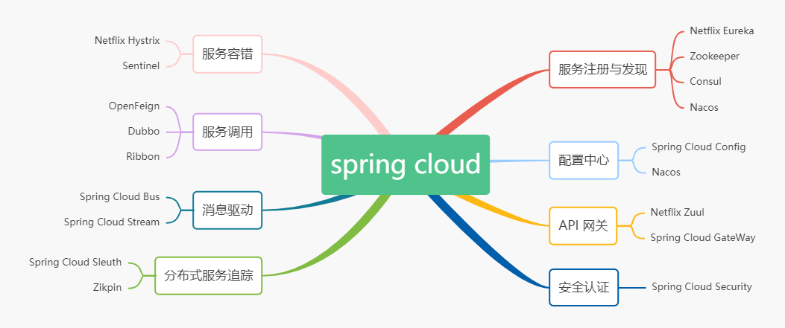

# Spring Cloud

> 作者: 潘深练
>
> 更新: 2022-03-10

## 一、简单理解 springcloud

Spring Cloud是一个基于Spring Framework的开源框架，用于快速构建分布式系统和微服务架构。

它提供了一组工具和库，用于解决微服务架构中的常见问题，例如服务发现、配置管理、负载均衡、流量控制、网关等。

Spring Cloud包含以下子项目：

1、Spring Cloud Config：提供分布式系统的外部配置支持，可以将应用程序的配置存储在集中的位置，并在所有应用程序之间共享。

2、Spring Cloud Netflix：包括多个组件，例如Eureka（服务发现）、Ribbon（客户端负载均衡）、Feign（声明式REST客户端）、Hystrix（断路器）等。

3、Spring Cloud Bus：通过消息代理将分布式系统中的所有应用程序连接起来，实现事件总线的功能。

4、Spring Cloud Sleuth：为分布式跟踪提供支持，可以在多个微服务之间跟踪请求的调用链路。

5、Spring Cloud Stream：基于Spring Boot构建消息驱动的微服务，可以将消息传递作为一个独立的组件，解耦微服务之间的通信。

6、Spring Cloud Security：提供安全性保护，包括OAuth2认证和授权等功能。

Spring Cloud还与其他框架集成，例如Zipkin（分布式跟踪系统）、Consul（服务发现和配置管理）等。

使用Spring Cloud可以快速构建高可用、可扩展、具有弹性的分布式系统和微服务架构。 

## 二、简单理解 springcloud Alibaba 

Spring Cloud和Spring Cloud Alibaba都是构建微服务架构的开源框架，它们的目标是解决微服务架构中的常见问题。虽然它们都是Spring Cloud的扩展，但它们之间还存在一些区别。

Spring Cloud是基于Spring Framework构建的开源框架，提供了一组工具和库，用于构建和管理微服务架构。Spring Cloud的核心组件包括Eureka（服务发现）、Ribbon（客户端负载均衡）、Feign（声明式REST客户端）、Hystrix（断路器）等。Spring Cloud还包括Spring Cloud Config、Spring Cloud Bus、Spring Cloud Sleuth等子项目。

Spring Cloud Alibaba是Spring Cloud的衍生品，由阿里巴巴开发和维护。它是基于Spring Cloud构建的开源框架，扩展了Spring Cloud的功能，提供了更多的组件，包括Nacos（服务发现和配置管理）、Sentinel（流量控制和熔断降级）、Dubbo（RPC框架）等。Spring Cloud Alibaba还包括Spring Cloud Alibaba RocketMQ、Spring Cloud Alibaba OSS等子项目。

因此，Spring Cloud和Spring Cloud Alibaba在一些核心组件上存在差异，例如服务发现和配置管理。

- Spring Cloud使用Eureka作为服务发现组件，而Spring Cloud Alibaba使用Nacos。
- Spring Cloud使用Spring Cloud Config作为配置管理组件，而Spring Cloud Alibaba使用Nacos Config。

此外，Spring Cloud Alibaba还提供了Sentinel作为流量控制和熔断降级组件，可以与其他Spring Cloud组件集成使用。

总的来说，Spring Cloud和Spring Cloud Alibaba都是构建微服务架构的优秀框架，具有一定的区别和优势。开发人员可以根据自己的需求选择适合自己的框架。